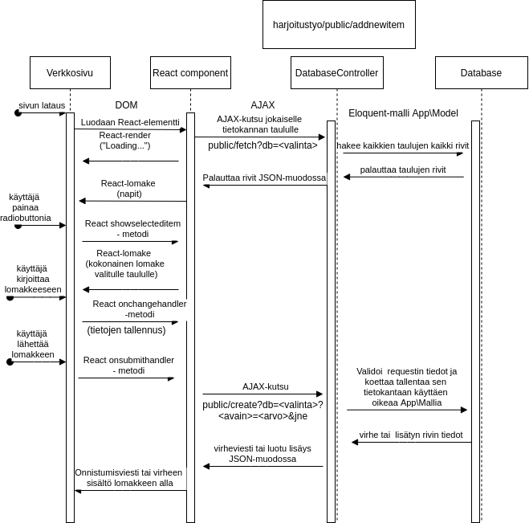
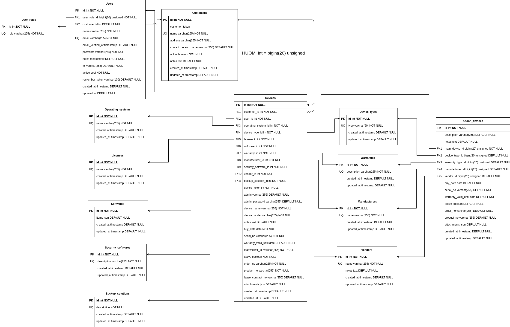
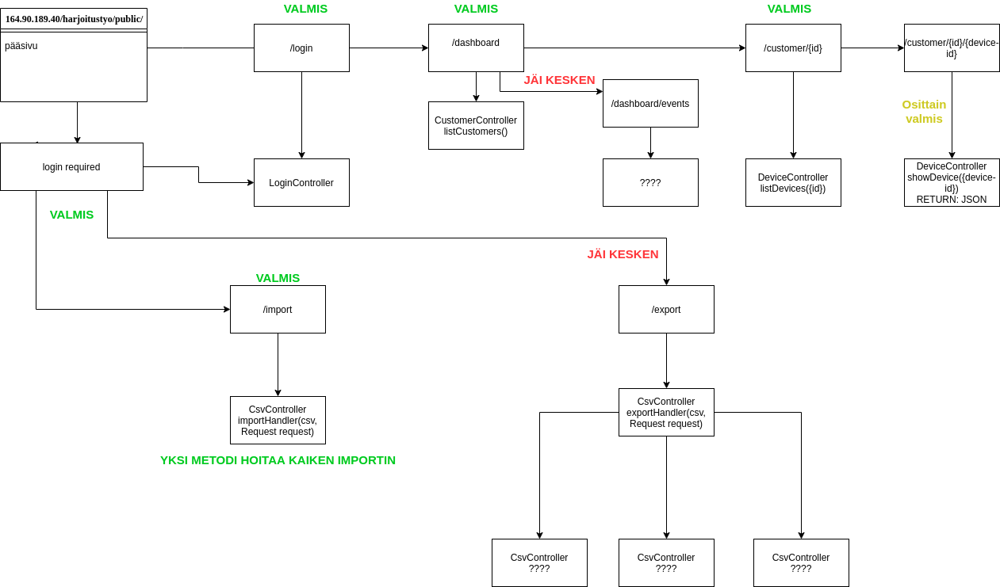
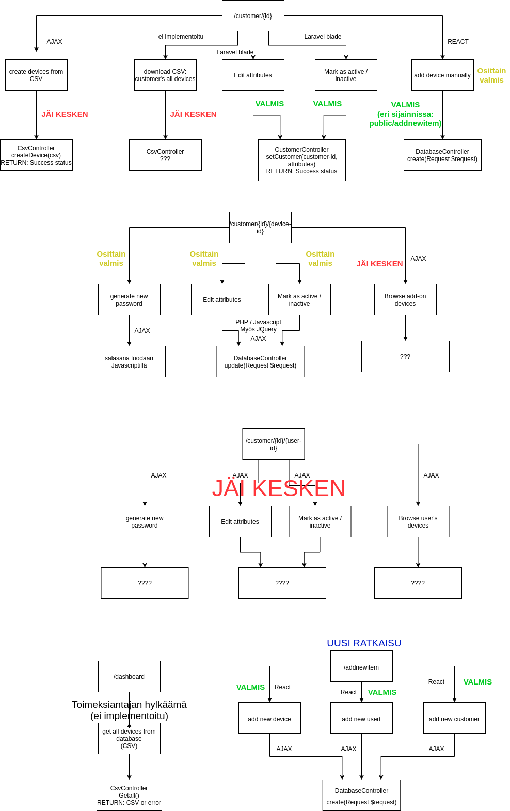
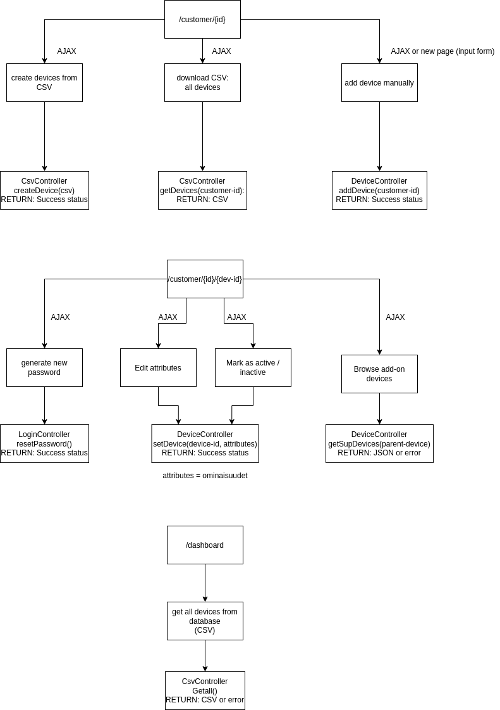
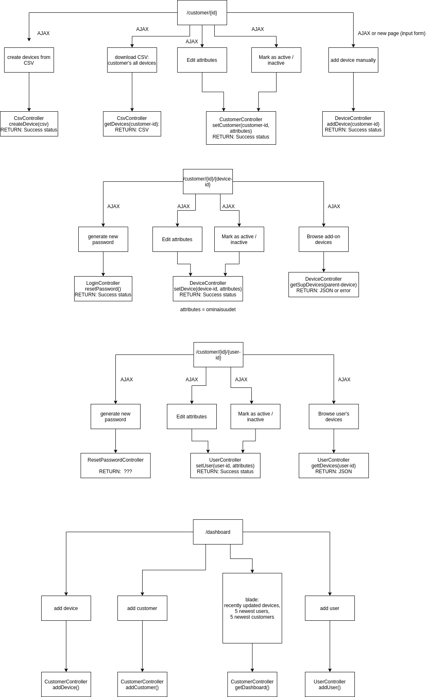

# Device Database with Laravel & React
Here you will find information about the project we made in the summer 2020 in courses web development and web-server development. This work combined the two courses into one, huge course assignment.

Click the following picture to go to our presentation video: 

The final report is here: http://164.90.189.40/harjoitustyo/public/raportti

Please try our application yourself, you can use the credentials provided in the link above! There you'll also find a detailed explanation of many things and solutions used in this project (in finnish language).
  
# Current Status of the Project
This project is in active development by yours truly. I have acquired permissions to publish any file that I have made "in my own time" - i.e., without being paid.
<!-- Commented out: detailed report is already available at http://164.90.189.40/harjoitustyo/public/raportti

-->

Below you will find our original documentation of the project in finnish.

## Aihe

Saimme toimeksiannoksi tehdä verkkosivun yritykselle. Sivusto sisältää muokattavan laitetietokannan kaikista yrityksen asiakkaiden laitteista. Tietokantaa tulee pystyä muokkaamaan ja käyttöliittymän tulee olla selkeä. Kohderyhmänä toimii työnantaja ja mikäli ehdimme tehdä asiakaskäyttöliittymän niin asiakkaat.

## Työnantajan alustavat vaatimukset

Laitekanta

- qr-koodi/viivakoodi haku laitteille
- tiedot tietokannassa
- csv lisäys ja download sivustolta
- asiakaskäyttöliittymä sekä adminkäyttöliittymä
- toiminto: ota / poista käytöstä
- toiminto: tilaa uusi + lähetä sposti (tukeen?)
- värikoodit käyttöliittymässä merkkaamaan aktiivisuuden tilaa
- ohjelmistot valinta voisi automaattisesti valita eikä aina manuaalisesti kirjoittaa
- ylläpidossa valmistajan takuu + takuupyyntö dokumentit valmiina esim. pdf
- toiminto: hälytys, kun vuokrailmoitus päättyy tai takuu päättyy
- toiminto: salasanageneraattori, ylläpitäjälle näkyvissä, näytä nappi
- käyttäjätasot: käyttäjä / tuki / ylläpito
- laitteen yhteydessä oma taulu lisälaitteille
- toiminto: tukkurin lähetyslista lisäys ohjelmaan (näkyvillä sivuilla)

## Käyttöliittymä

Käyttöliittymä alustavasti toimisi PHP:llä (Laravel Framework). Login, rekisteröinti ja asiakasnäkymä Laravelilla. Asiakasnäkymästä voi valita asiakkaan joka toimii myös Laravelillä. Asiakaskohtaisessa laitenäkymässä voisi käyttää reactia. Päänäkymässä voisi olla joitain graafeja javascriptillä esim. takuutiedoista ja lisenssien umpeutumisesta jne. Ajax toteutuksena käytetään jQueryä. Sivuston sisältö latautuu dynaamisesti ajaxin avulla.

Tutkitaan samalla voitaisiinko projektissa käyttää kurssin ulkopuolista frameworkkiä.

Käytetään bootstrappiä tyylien kanssa.

## Tietokanta

Tietokanta ratkaisuna käytetään mysql:llää. Laravel ottaa yhteyden mysql tietokantaan Eloquent Frameworkin kautta.

Tietokannan tavoitesisältö alustavasti:

- LAITETUNNUS (VTXXXXXX, viivakoodi)
- ASIAKAS (olisiko oma taulunsa, johon tulisi osoite tiedot myös)
- JÄRJESTELMÄNVALVOJA (käyttäjätunnus ja salasana, (generoituna) voi tehdä myös erilliset sarakkeet)
- KÄYTTÄJÄ (voiko tehdä asiakastauluun vai pitääkö tehdä omansa)
- KÄYTTÖJÄRJESTELMÄ (Valmis listaus, johon voi tarvittaessa lisätä, oletuksena Windows 10 Pro)
- LAITEMALLI (Voisi kerätä listaa syötetyistä laitemalleista, joita voi selata)
- LAITETYYPPI (valmis listaus, johon ei tarvitse lisätä)
- LAITTEENNIMI (tekstikenttä 255)
- LISÄLAITTEET (erillinen taulu, josta voidaan hakea listaus sitten käyttöliittymään)
- LISÄTIETOJA (MEMO)
- LISENSSITIEDOT (MEMO)
- LUOTU (päiväys milloin luotu)
- OHJELMISTOT (listausohjelmistoista sekä mahdollisuus valita ”ryhminä” esim. Perusohjelmat)
- OSTOPÄIVÄ (tukkurintilausvahvistuksen päivämäärä)
- SARJANUMERO (laitteen sarjanumero PAKOLLINEN KENTTÄ)
- TAKUU (listaus jota ei tarvitse muuttaa)
- TAKUU VOIMASSA (päivämäärä kenttä)
- TEAMVIEWER (numerokenttä)
- TIETOTURVA (listaus tietoturva tuotteista, joita voi lisätä)
- TILA (Aktiivinen / Ei aktiivinen) käyttöliittymässä värikoodein)
- TILAUSNUMERO (tukkurin tilausvahvistuksen numero)
- TOIMITTAJA (tukkurin nimi tilausvahvistukselta)
- TUOTENUMERO (valmistajantuotenumero tilausvahvistukselta)
- VALMISTAJA (valmistajan nimi tilausvahvistukselta)
- VARMUUSKOPIOINTI (listaus, voi lisätä)
- VUOKRASOPIMUSNUMERO (Mahdollinen Siemens vuokrasopimusnumero, A0000000)
- LIITTEET (liitteen tallennusmahdollisuus, PDF, JPG, PNG)

## Ryhmän työnjaon suunnittelu

Alustavasti:

Lassi: Laravelin perusmäärittelyt (routet, controllerit, kirjautumisominaisuudet), CSV->tietokanta ja tietokanta->CSV. Tietojen lisäyssivu.

Tuukka: Mysql tietokanta ja Laravelin migraatiotiedostot. Ajax mietintöjä.

Tatu: Bladeja ja bootstrappia. Salasanan generointi. Graafien luontia.

## Alustava suunnitelma komponenttitasolla 1.8.2020

Seuraava on suunnitelma sivuston päänäkymistä

Seuraava on suunnitelma sivuston yksityiskohtaisimmista toiminnoista

</img>

## Tietokannan rakenne - suunnitelma 5.8.2020 (päivitetty 6.8)

</img>

## Suunnittelu - 7.8.2020

